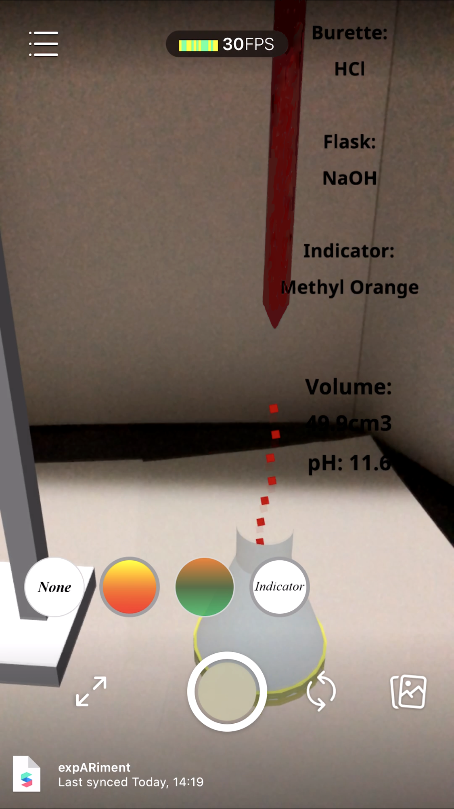
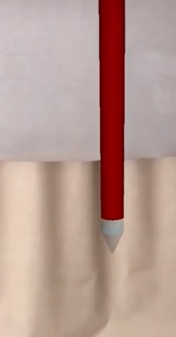
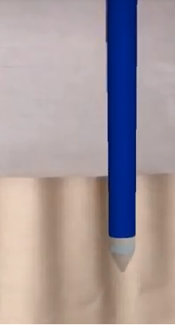
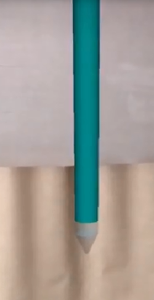
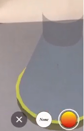

# expARiment 
### Conduct chemistry practicals with AR!
Check out the YouTube video for expARiment [here](https://youtu.be/BY-yT4CVuck)!



```diff
! Chemicals in the house
```
HCl | H2S04 | NaOH | NH3
-----|------ | -----|-------
 |  |  | 
```diff
+ Indicators
```
Methyl Orange | Screened Methyl Orange
----------- | ------------
 | 
```diff
- Functionalities
```
- Drag and place your apparatus
- Long tap to let your burette spray
- Short tap to control your burette

